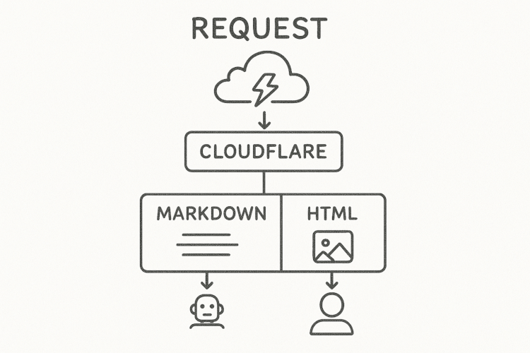

# AI Markdown Web Worker

<p align="center">
  
</p>

A Cloudflare Worker that automatically detects AI user agents and serves them markdown versions of your web content for better parsing and understanding.

**[Quick Start](#quick-start)** | **[Installation](#installation)** | **[Configuration](#configuration)** | **[Testing](#testing)** | **[About](#about-aivory)**

## Quick Start

**No build tools needed!** Download the pre-built bundle and paste it into Cloudflare Dashboard:

1. Download: [release/worker.bundle.js](https://raw.githubusercontent.com/aivorynet/cloudflare-ai-markdown-worker/main/release/worker.bundle.js)
2. Paste into Cloudflare Workers Dashboard
3. Add routes for your domain
4. Done!

See [Installation](#installation) for detailed instructions and customization options.

## Two Modes of Operation

### Mode 1: Pre-generated Markdown (STRONGLY RECOMMENDED)

Generate markdown files for your pages and place them in a dedicated directory (e.g., `/md/`). The worker will serve these files to AI agents.

**Why this matters:**
- **10-100x better quality** - You control exactly what AI sees
- **Fast** - No conversion overhead, instant response
- **Precise** - Clean, semantic markdown without HTML artifacts
- **Customizable** - Include exactly what you want, exclude what you don't
- **Reliable** - No dependency on HTML structure parsing

**URL Mapping Examples:**
```
https://example.com/          → /md/index.md
https://example.com/about/    → /md/about/index.md  (or /md/about.md)
https://example.com/docs/api/ → /md/docs/api/index.md
```

**IMPORTANT**: Pre-generating markdown files makes a REAL DIFFERENCE. The quality difference is night and day - AI agents get clean, semantic content instead of converted HTML with potential formatting issues, navigation elements, and other noise.

### Mode 2: On-the-Fly HTML Conversion (Fallback Only)

If pre-generated markdown doesn't exist, the worker automatically converts HTML to markdown using Turndown.

**This is a FALLBACK, not a recommendation:**
- **Lower quality** - HTML conversion is imperfect
- **Slower** - Adds 50-200ms conversion time per request
- **Less precise** - May include navigation, footers, and other unwanted content
- **Unreliable** - Depends on HTML structure and may break with site updates

**Use this only when:**
- You're testing the worker before setting up markdown generation
- You have dynamic content that can't be pre-generated
- You need a quick temporary solution

## About This Project

This project is maintained by [AIVory](https://aivory.net), a company specializing in real-time code compliance validation. We help developers ensure their code meets GDPR, HIPAA, SOC 2, PCI-DSS, and other compliance standards directly in their IDE and AI coding assistants.

**Why we built this:** AI agents spend significant tokens parsing HTML documents. By serving clean markdown to AI agents, we help reduce token usage while improving content comprehension. This benefits both AI providers and website owners by making content more accessible and efficient to process.

Check out our compliance tools at [aivory.net](https://aivory.net) - they catch compliance violations in real-time as you code, before commit, before deploy, before audit.

---

## Features

- **AI Agent Detection**: Automatically identifies requests from Claude, GPT, Gemini, Perplexity, and other AI bots
- **Pre-generated Markdown Support**: Serves clean, hand-crafted markdown files for optimal AI comprehension (STRONGLY RECOMMENDED)
- **HTML Conversion Fallback**: Automatic HTML to markdown conversion when pre-generated files don't exist (NOT RECOMMENDED for production)
- **SEO Safe**: Markdown versions include `noindex, nofollow` headers
- **Zero Impact**: Regular users see normal HTML, completely unaffected
- **Analytics Ready**: Adds custom headers for tracking AI traffic
- **Configurable**: Customize paths, content extraction, and AI detection

## How It Works

1. Worker intercepts all requests to your domain
2. Checks if the User-Agent is an AI bot (Claude, GPT, Gemini, etc.)
3. For AI bots:
   - **First**: Tries to fetch pre-generated markdown from configured path (e.g., `/md/about/index.md`)
   - **Fallback**: If not found, converts the HTML response to markdown on-the-fly using Turndown
   - Adds `X-Robots-Tag: noindex, nofollow` header for SEO safety
4. For regular users: serves normal HTML content without modification
5. Adds tracking headers (`X-AI-Agent`) for analytics

## Installation

### Prerequisites

- Cloudflare account
- Domain configured on Cloudflare
- Node.js and npm installed
- Wrangler CLI: `npm install -g wrangler`

### Step 1: Get the Worker Code

**Option A: Use Pre-built Bundle (Easiest)**

Download the pre-built bundle from the repository:
- **Direct download**: [release/worker.bundle.js](https://raw.githubusercontent.com/aivorynet/cloudflare-ai-markdown-worker/main/release/worker.bundle.js)
- Or clone and copy from `release/worker.bundle.js`

This bundle includes Turndown and all dependencies - ready to paste into Cloudflare Dashboard.

**Option B: Build from Source**

```bash
# Clone the repository
cd ai-markdown-web-worker

# Install dependencies (including Turndown for HTML to Markdown conversion)
npm install

# Build the bundle
npm run build
# Output: dist/worker.bundle.js
```

### Step 2: Configure the Worker (Optional)

The worker works with default settings, but you can customize it by editing the `CONFIG` object.

**If using pre-built bundle**: Edit `release/worker.bundle.js` directly (search for `const CONFIG = {`)

**If building from source**: Edit the `CONFIG` object in `worker.js`:

```javascript
const CONFIG = {
  // Path prefix for markdown files (default: '/md')
  markdownPathPrefix: '/md',

  // File pattern: 'index' for /md/about/index.md or 'direct' for /md/about.md
  markdownFilePattern: 'index',

  // CSS selectors for extracting main content (tries in order)
  contentSelectors: ['main', 'article', '.content'],

  // Add or remove AI user agents to detect
  aiUserAgents: ['claude', 'gptbot', 'gemini', /* ... */]
};
```

Then rebuild with `npm run build` if you made changes.

### Step 3: Deploy

**Option A: Deploy via Wrangler CLI (Easiest)**

```bash
# Login to Cloudflare
wrangler login

# Edit wrangler.toml and set your domain in routes (uncomment and configure)

# Deploy (Wrangler automatically bundles Turndown and dependencies)
wrangler deploy
```

**Option B: Deploy via Cloudflare Dashboard**

1. Download or copy the bundled worker code:
   - Use pre-built: `release/worker.bundle.js`
   - Or build from source: `npm run build` (creates `dist/worker.bundle.js`)

2. Deploy to Cloudflare:
   - Go to Cloudflare Dashboard → Workers & Pages
   - Click "Create Application" → "Create Worker"
   - Paste the contents of the bundle file into the editor
   - Click "Save and Deploy"
   - Go to "Settings" → "Triggers" to add routes

### Step 4: Add Routes

After deployment (via either method), configure routes:

1. Go to Cloudflare Dashboard → Workers & Pages
2. Select your worker
3. Go to "Settings" → "Triggers" tab
4. Add routes for your domain:
   - `yourdomain.com/*`
   - `www.yourdomain.com/*` (if using www)
5. Save

**Note**: If you used Wrangler, you can also configure routes directly in `wrangler.toml`.

### Step 5: SEO Configuration (CRITICAL)

**IMPORTANT: You MUST configure your markdown directory for SEO safety:**

1. **Add to robots.txt** (prevents search engines from indexing markdown versions):
   ```
   User-agent: *
   Disallow: /md/
   ```

2. **Exclude from sitemap** - Ensure your sitemap.xml does NOT include `/md/*` URLs

3. **Verify noindex headers** - The worker automatically adds `X-Robots-Tag: noindex, nofollow` headers to all markdown responses, but excluding from robots.txt and sitemaps provides additional protection.

**Why this matters:** Search engines should only index your regular HTML pages, not the markdown versions served to AI agents. Without proper configuration, you risk duplicate content issues.

## Configuration

All configuration is done via the `CONFIG` object at the top of `worker.js`:

### Markdown Path Prefix

Change where markdown files are served from:

```javascript
markdownPathPrefix: '/md',  // Default
// Or use: '/ai', '/markdown', etc.
```

### File Naming Pattern

Choose how markdown files are organized:

```javascript
markdownFilePattern: 'index',  // Directory style: /md/about/index.md
// Or use: 'direct'            // File style: /md/about.md
```

**Examples:**
- With `'index'`: `/about/` → `/md/about/index.md`
- With `'direct'`: `/about/` → `/md/about.md`

### Content Extraction

Customize which HTML elements are extracted for conversion:

```javascript
contentSelectors: [
  'main',              // <main> element
  'article',           // <article> element
  '[role="main"]',     // Elements with role="main"
  '.content',          // Elements with class="content"
  '#main-content'      // Elements with id="main-content"
]
```

The worker tries each selector in order and uses the first match.

### AI User Agents

Add or remove AI bots to detect:

```javascript
aiUserAgents: [
  'claude', 'anthropic',
  'gptbot', 'chatgpt',
  'gemini',
  // Add your custom AI bot here
]
```

## Generating Markdown Files

**YOU SHOULD DO THIS.** Pre-generating markdown files is not optional if you want quality results. The HTML conversion fallback is a last resort, not a production solution.

To generate markdown files, you have several options:

### Option 1: Static Site Generators

If you use a static site generator (Hugo, Jekyll, Next.js, etc.), configure it to output markdown versions of your pages alongside HTML.

### Option 2: Build Script

Create a build script that converts your content to markdown and saves it to the `/md/` directory matching your URL structure.

Example directory structure:
```
public/
├── index.html              -> HTML version
├── about.html
├── docs/
│   └── api.html
└── md/                     -> Markdown versions
    ├── index.md
    ├── about/
    │   └── index.md
    └── docs/
        └── api/
            └── index.md
```

### Option 3: Manual Creation

For small sites, manually create markdown versions of your pages in the `/md/` directory.

### Content Quality Tips

For best results with on-the-fly HTML conversion:

1. Structure your HTML semantically (use `<main>`, `<article>` tags)
2. Use standard HTML tags (h1-h6, p, a, ul, li, etc.)
3. Avoid complex nested structures
4. Use the `contentSelectors` config to target your main content area

## Testing

**Test AI agent detection:**
```bash
curl -H "User-Agent: claude" https://yourdomain.com/about/ -v
```

**Check headers:**
```bash
curl -I -H "User-Agent: gptbot" https://yourdomain.com/
```

Look for:
- `Content-Type: text/markdown`
- `X-AI-Agent: detected` or `X-AI-Agent: detected-converted`
- `X-Robots-Tag: noindex, nofollow`

**Test regular users:**
```bash
curl https://yourdomain.com/
# Should return normal HTML
```

## Headers Added (AI Agents Only)

The worker adds custom headers only when serving markdown to AI agents. Regular user requests are not modified.

- `X-AI-Agent: detected` - Pre-generated markdown file was served
- `X-AI-Agent: detected-converted` - HTML was converted to markdown on-the-fly
- `X-Original-Path` - Original requested path
- `X-Markdown-Path` - Markdown file path (if pre-generated)
- `X-Robots-Tag: noindex, nofollow` - Prevents search engine indexing
- `Content-Type: text/markdown; charset=utf-8` - Markdown content type

## Robots.txt

Add to your `robots.txt` to prevent search engines from indexing markdown versions:

```
User-agent: *
Disallow: /md/
```

## HTML to Markdown Conversion

The worker uses [Turndown](https://github.com/mixmark-io/turndown) for high-quality HTML to markdown conversion. It handles:

- **Semantic HTML**: Properly converts headings, paragraphs, lists, tables
- **Code blocks**: Preserves formatting for code snippets
- **Links and images**: Maintains proper markdown syntax
- **Nested structures**: Handles complex HTML layouts

For best results:
1. **Pre-generate markdown files** (recommended for static sites)
2. **Customize content selectors** in CONFIG to match your HTML structure
3. **Structure HTML semantically** for better extraction

## Performance

**With pre-generated markdown:**
- Worker adds ~1-5ms latency per request
- Minimal overhead - just file serving
- Scales to any traffic level

**With HTML conversion (NOT RECOMMENDED):**
- Adds 50-200ms conversion time per request
- Requires parsing entire HTML DOM
- Higher memory usage
- Does not scale well

**Bottom line**: Pre-generate your markdown files. The performance difference alone justifies it, and the quality difference makes it essential.

## Browser Compatibility

The worker runs on Cloudflare's edge network and is compatible with all browsers. No client-side JavaScript required.

## License

MIT License - See LICENSE file for details

## Contributing

Contributions welcome! Please open an issue or submit a pull request.

## About AIVory

AIVory provides real-time compliance and security validation for developers. Our tools integrate directly into IDEs and AI coding assistants to catch violations as you code.

- Website: [aivory.net](https://aivory.net)
- Documentation: [aivory.net/docs](https://aivory.net/docs)
- Contact: support@aivory.net

We believe in making the web more efficient and accessible for both humans and AI agents.

## Credits

This project uses [Turndown](https://github.com/mixmark-io/turndown) by Dom Christie for HTML to Markdown conversion. Turndown is a highly configurable library that converts HTML to clean, semantic markdown.
